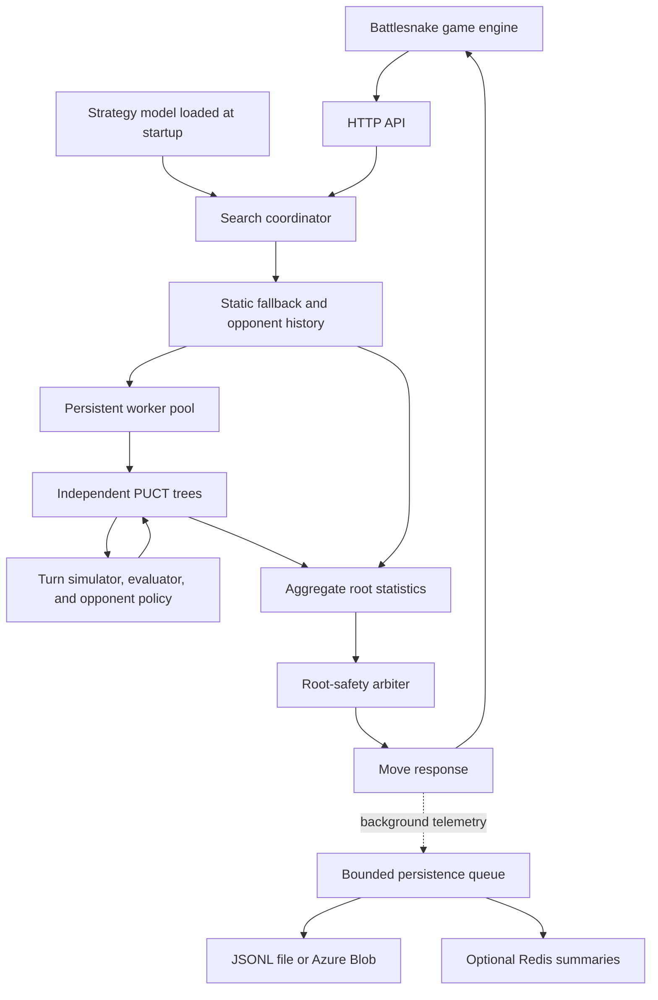

# Nicanelo 🐍

A [Battlesnake](https://docs.battlesnake.com/) engine written in TypeScript. Nicanelo receives a board state over HTTP and chooses a move using tactical heuristics, simultaneous-turn simulation, and Monte Carlo Tree Search with PUCT.

The repository contains the game-playing service, local tournament tools, telemetry processing, offline model training, and Azure infrastructure. The simulator supports **Standard rules**; the evaluation harness supports **11×11 games with two to four initial snakes**.

- [Technology stack](#technology-stack)
- [Architecture](#architecture)
- [Run locally](#run-locally)
- [HTTP API](#http-api)
- [Local games and tournaments](#local-games-and-tournaments)
- [Docker](#docker)
- [Configuration](#configuration)
- [Telemetry and data layout](#telemetry-and-data-layout)
- [Models and offline training](#models-and-offline-training)
- [Azure deployment](#azure-deployment)
- [Development and verification](#development-and-verification)
- [Project structure](#project-structure)
- [Technical documentation](#technical-documentation)

## Technology stack

| Area | Technology | Role |
| --- | --- | --- |
| Application language | TypeScript 5.9 | Strictly typed game logic, server, evaluation, and training tools. |
| Runtime | Node.js 22+; Node.js 24 in Docker | Native ES modules and CPU execution. |
| HTTP server | `node:http` | Battlesnake webhook handling and JSON responses. |
| Parallel execution | `node:worker_threads` | Persistent search workers and offline dataset/training workers. |
| Game rules | Custom TypeScript Standard simulator | Deterministic simultaneous-turn transitions. |
| Move search | MCTS with PUCT | Policy-guided exploration and sampled opponent responses. |
| Spatial analysis | Flood fill, BFS, territory and trap analysis | Reachable space, survivable food routes, mobility, and tactical pressure. |
| Offline learning | TypeScript gradient-based trainers | Softmax policy models and a sigmoid value model. |
| Testing | `node:test`, `node:assert` | Unit, integration, and regression tests. |
| Local game engine | Official Battlesnake CLI, written in Go | Seeded games, timeouts, and replay capture. |
| Durable storage | Azure Blob Storage | Immutable telemetry events, datasets, manifests, and model artifacts. |
| Optional hot storage | Azure Managed Redis | Compact game summaries and observed opponent move counts with TTLs. |
| Cloud authentication | Microsoft Entra and `DefaultAzureCredential` | Token-based access to Blob and Redis. |
| Packaging and deployment | npm, Docker, Bicep, Azure Container Apps and Jobs | Builds, service deployment, evaluation jobs, and training jobs. |

Runtime npm dependencies are `@azure/identity`, `@azure/storage-blob`, `@redis/client`, and `@redis/entraid`. TypeScript and Node.js type definitions are development dependencies. Algorithm implementations and training equations live in this repository.

## Architecture

### Runtime flow



### Bootstrap and HTTP layer

[`src/index.ts`](src/index.ts) loads a strategy model, initializes the persistent search pool, and waits for workers before opening the listener. The loaded artifact supplies evaluator weights, a policy prior, an opponent policy, and search settings.

[`src/server.ts`](src/server.ts) handles the four Battlesnake routes. Requests carry the complete current game state. The server parses JSON with a 1,000,000-byte body limit and responds with JSON. It also emits structured lifecycle and move logs.

`/start` and `/end` reset memory for the corresponding game. On `SIGINT` or `SIGTERM`, the listener closes; server closure releases the worker pool and starts persistence shutdown.

### Rules and turn simulation

[`src/domain/`](src/domain/) contains board operations, move legality, health changes, collision resolution, and terminal outcomes. `simulateTurn` returns a new state from a joint action, preserving the simultaneous nature of the game.

The deterministic transition handles movement, health loss, configured hazard damage, feeding, growth, and eliminations. Food spawning is a separate seeded chance transition used by search because the request payload does not expose the official engine's random state.

The simulator rejects non-Standard rulesets. Map mutations such as Royale shrinking are outside its implemented transition model.

### Spatial evaluation and tactical strategy

[`src/evaluation/`](src/evaluation/) scores states and candidate moves using centralized weights:

```text
score = terminal_score + sum(feature_i * weight_i)
```

Terminal outcomes dominate heuristic scores. Features measure survival, reachable space, space relative to length, territory, health, food access, length advantage, mobility, head-to-head control, opponent pressure, hazard and wall distance, tail access, and trap safety.

Food evaluation combines health urgency, survivable route distance, maintenance appetite, growth opportunities, available space, and enclosure risk. Offensive evaluation measures the effect of a move on a specific rival's space and exits while accounting for our escape options and third-party threats.

Tactical intents distinguish head-to-head attacks, constriction, space denial, third-party opportunities, resource growth, recovery, and survival. Resource gates preserve critical food routes, and safety gates constrain attack incentives.

[`src/strategy/static-policy.ts`](src/strategy/static-policy.ts) ranks conservative moves and computes the deterministic fallback before search begins. [`src/strategy/strategic-posture.ts`](src/strategy/strategic-posture.ts) derives the desired policy posture from health, mobility, length control, resource urgency, and the number of remaining rivals.

### Opponent behavior

The coordinator infers observable opponent moves from consecutive board states. It updates per-game histories for aggression, resource acquisition, health management, and conservatism.

[`src/search/opponent-policy.ts`](src/search/opponent-policy.ts) converts candidate move features into a categorical probability distribution using softmax. Historical interaction features are weighted by confidence. When little history is available, the generic features carry the prediction.

During simulation, rival moves are sampled independently into a joint action and resolved simultaneously. A search edge can retain multiple sampled outcomes for the same move. Nicanelo's own policy prior uses its desired strategic posture.

### Search coordination and move selection

[`src/search/search-pool.ts`](src/search/search-pool.ts) manages workers created once at startup. Each worker runs its own tree in [`src/search/mcts.ts`](src/search/mcts.ts); the coordinator sends shared inputs and collects compact statistics.

PUCT combines estimated value and a policy exploration term:

```text
Q(s, a) + c_puct * P(s, a) * sqrt(N(s)) / (1 + N(s, a))
```

The search considers physically viable moves, including contested cells that the conservative fallback may avoid. With enough workers and budget, the pool coordinates initial root coverage, focuses additional samples on promising contenders, and resumes unrestricted PUCT. Root statistics aggregate visits and values across workers.

The effective search budget is:

```text
min(configured_search_ms, max(0, game_timeout_ms - response_reserve_ms))
```

Results arriving after the coordinator deadline are excluded from that response. Incomplete coverage uses the precomputed fallback. Visit counts normally determine the search proposal, with narrowly constrained risk-based overrides.

After the proposal, [`src/search/root-safety-arbiter.ts`](src/search/root-safety-arbiter.ts) checks joint immediate replies in Standard positions with at most three rivals. It can replace a move that leaves no continuation when an admissible alternative exists. The branching-reserve extension is an optional experimental setting.

The search budget applies to search work; static evaluation, arbitration, serialization, and scheduling also contribute to request duration.

### Memory ownership and reuse

The coordinator keeps opponent history by `game.id`. Each worker owns a private persistent tree and bounded move/evaluation caches. Workers exchange inputs and root statistics through messages.

A canonical state key covers the rules, turn, board, food, hazards, snake health, and body coordinates. A matching observed state can re-root a sampled subtree. Context changes can discount existing evidence; an unmatched state or incompatible settings can start a fresh tree.

Memory is disposable and local to a process. A restart or a request routed to another replica can lose accumulated search evidence. Every request still supplies the board needed for a new decision. Redis stores compact summaries; it does not transfer or restore these trees.

### Persistence boundary

[`src/persistence/`](src/persistence/) implements a bounded background queue and optional storage adapters. Move telemetry is queued after the HTTP response is sent.

The local sink exclusively creates one JSONL file per process. The Blob sink conditionally creates one immutable event object. The Redis adapter lazily connects over TLS and writes a latest-game summary plus observed move counts with a TTL.

Persistence is best effort. A full queue drops new work and logs the drop; failed jobs log an error. Storage results do not change the chosen move. Shutdown attempts to drain work within the configured timeout.

## Run locally

Install **Node.js 22 or later** and npm. From the project root:

```bash
npm ci
npm run build
npm start
```

The service binds to `0.0.0.0` and listens at **http://localhost:8000** by default. Check its metadata from another terminal:

```bash
curl http://localhost:8000/
```

Azure, Redis, Docker, and the game CLI are optional for running the HTTP service. By default, cloud persistence is disabled and the built-in heuristic model is used.

Settings are read from the process environment. For example:

```bash
PORT=8000 SEARCH_WORKERS=2 SEARCH_TIME_BUDGET_MS=150 npm start
```

After editing TypeScript, run `npm run build` again before restarting. The compiled entry point is `dist/src/index.js`.

## HTTP API

| Method | Route | Request | Response |
| --- | --- | --- | --- |
| `GET` | `/` | No body. | API version, author, color, head, tail, and advertised version. |
| `POST` | `/start` | Battlesnake game state. | `{"ok": true}`; resets the game's search/history memory. |
| `POST` | `/move` | Battlesnake game state. | A move: `up`, `down`, `left`, or `right`. |
| `POST` | `/end` | Final Battlesnake game state. | `{"ok": true}`; releases game memory and records the end. |

POST requests follow the [official Battlesnake API](https://docs.battlesnake.com/api). A move response looks like:

```json
{
  "move": "up"
}
```

Unrecognized routes return `404`. Request-processing errors return `400` with a JSON error message. To register Nicanelo with a Battlesnake platform, provide the base URL of an instance reachable by that platform's game engine.

## Local games and tournaments

Install the [official Battlesnake CLI](https://github.com/BattlesnakeOfficial/rules/blob/main/cli/README.md) and make the `battlesnake` binary available on your `PATH`.

With Nicanelo running, start a solo game:

```bash
battlesnake play \
  --width 11 \
  --height 11 \
  --name Nicanelo \
  --url http://localhost:8000 \
  -g solo
```

For a local smoke tournament, keep the first instance on port 8000 and start a second independent instance in another terminal:

```bash
PORT=8001 SEARCH_WORKERS=2 npm start
```

Then run the batch harness from a third terminal:

```bash
npm run gym -- \
  --games 10 \
  --base-seed 2026100100 \
  --run-id local-demo \
  --output data/telemetry/raw/gym/local-demo \
  --snake 'Nicanelo=http://127.0.0.1:8000' \
  --snake 'LocalOpponent=http://127.0.0.1:8001'
```

The harness runs Standard 11×11 games with a default request timeout of 500 ms. It accepts two to four participants, executes local games sequentially, and rotates the roster order across seeds.

Each controlled Nicanelo seat needs a separate process so its memory remains independent. For competitive evaluation, use pinned independent opponents and paired baseline/candidate runs with identical seeds, rosters, rotations, and search settings.

Each completed game produces a replay, a summary, and derived move observations. Run metadata and the batch manifest retain provenance, participant order, successes, and failures. Managed evaluation jobs also capture Nicanelo's PUCT targets.

See [the tournament guide](docs/tournament-corpus.md) and [the audited Snake Zoo images](infra/zoo/README.md) for opponent setup and corpus details.

## Docker

Build and run the service:

```bash
docker build -t nicanelo .
docker run --rm -p 8000:8000 nicanelo
```

The multi-stage image uses `node:24-bookworm-slim`, compiles TypeScript, removes development dependencies, and runs as the `node` user. It includes the checked-in `heuristic-adaptive-control-v1` artifact and sets `MODEL_PATH` to it.

Pass settings with `-e`:

```bash
docker run --rm -p 8000:8000 \
  -e SNAKE_AUTHOR=your-username \
  -e SEARCH_WORKERS=2 \
  nicanelo
```

`.dockerignore` restricts the build context to the required sources, tests, selected model, and image inputs. Local telemetry and corpora stay outside the context.

`Dockerfile.job` packages the service and offline tools alongside the official Battlesnake CLI pinned to `v1.2.3` and the Coreyja opponent executable. Its default command runs the Azure evaluation job. Supply `COREYJA_IMAGE` explicitly; it has no default registry address. The selected image must contain `/app/web-axum` (see the [opponent build guide](infra/zoo/README.md)). Job command overrides select preparation or training entry points.

```bash
docker build -f Dockerfile.job \
  --build-arg COREYJA_IMAGE="$COREYJA_IMAGE" \
  -t nicanelo-job .
```

## Configuration

Settings are supplied through environment variables. For local use, prefix the startup command:

```bash
PORT=8000 SEARCH_WORKERS=2 SEARCH_TIME_BUDGET_MS=150 npm start
```

### Server and search

| Variable | Default | Purpose |
| --- | --- | --- |
| `PORT` | `8000` | HTTP port. |
| `SEARCH_WORKERS` | Up to `4`, based on available CPUs | Number of persistent workers. |
| `SEARCH_TIME_BUDGET_MS` | `150` | Search time limit per move. |
| `SEARCH_RESPONSE_RESERVE_MS` | `100` | Time reserved before the game timeout. |
| `SEARCH_ROOT_SAFETY_ARBITER` | `true` | Safety arbitration at the root. |
| `SEARCH_ROOT_BRANCHING_RESERVE` | `false` | Experimental extension for enclosed positions. |
| `SEARCH_FALLBACK_PROTECTION` | `false` | Heuristic fallback veto for comparative evaluations. |
| `SEARCH_STRATEGIC_ROOT_PRIOR` | `true` | Strategic evaluation to prioritize root moves. |
| `SEARCH_SIMULATE_FOOD_SPAWNS` | `true` | Food spawning during search. |
| `SEARCH_ROLLOUT_POLICY` | `policy` | Simulation policy: `policy` or `uniform`. |
| `SEARCH_REUSE_OPPONENT_CONTEXT_TREE` | `true` | Preserves evidence when opponent context changes. |
| `SEARCH_TREE_REUSE_CONTEXT_DECAY` | `0.5` | Fraction of evidence retained after that context changes. |
| `MODEL_PATH` | Unset locally | JSON artifact path; when unset, uses the built-in heuristic model. |

The effective budget is the smaller of `SEARCH_TIME_BUDGET_MS` and the game timeout minus `SEARCH_RESPONSE_RESERVE_MS`, with a minimum of zero. Total request duration also includes the remaining processing.

Appearance is configured through `SNAKE_AUTHOR` (empty), `SNAKE_COLOR` (`#16A34A`), `SNAKE_HEAD` (`default`), `SNAKE_TAIL` (`default`), and `SNAKE_VERSION` (`0.1.0`). The last setting is the version advertised by the API; the model version comes from the loaded artifact.

### Optional persistence

| Variable | Default | Purpose |
| --- | --- | --- |
| `FILE_TELEMETRY_PATH` | Unset | Exclusive JSONL file for one simulation process. |
| `AZURE_BLOB_ENABLED` | `false` | Enables Blob Storage telemetry. |
| `AZURE_STORAGE_ACCOUNT_URL` | Unset | Storage account URL. |
| `AZURE_STORAGE_CONTAINER` | `battlesnake-corpus` | Telemetry container. |
| `AZURE_STORAGE_PREFIX` | `telemetry/raw/live` | Record prefix. |
| `REDIS_ENABLED` | `false` | Enables temporary Redis summaries. |
| `REDIS_ENDPOINT` | Unset | Azure Managed Redis endpoint, including the port. |
| `REDIS_KEY_PREFIX` | `battlesnake` | Key prefix. |
| `REDIS_TTL_SECONDS` | `1800` | Summary lifetime. |
| `REDIS_CONNECT_TIMEOUT_MS` | `1500` | Redis connection timeout. |
| `PERSISTENCE_QUEUE_CAPACITY` | `512` | Persistence queue capacity. |
| `PERSISTENCE_FLUSH_TIMEOUT_MS` | `5000` | Queue drain timeout during shutdown. |

File and Blob telemetry are alternative sinks. Azure adapters authenticate through Microsoft Entra, and the infrastructure configures managed identities. Storage failures are logged without changing the selected move.

## Telemetry and data layout

The service emits structured JSON logs for startup, lifecycle requests, and moves. Move diagnostics include elapsed time, iterations, root statistics, completed/requested workers, reused tree evidence, cache metrics, fallback protection, and root-safety decisions.

Optional durable records preserve the original request state, selected and fallback moves, model version, observed rival moves, timing, and search diagnostics.

Local simulation telemetry can be enabled with a fresh path:

```bash
FILE_TELEMETRY_PATH=data/telemetry/local/run-001.jsonl npm start
```

Use a new file name for each process/run because the file sink uses exclusive creation.

The data pipeline separates raw records and derived artifacts:

```text
data/telemetry/
  raw/
    live/<UTC-date>/<gameId>/      Live telemetry and organized replays
    gym/<runId>/.../<gameId>/      Controlled evaluation data
  eligible/<selectionId>/         Structurally eligible games
  references/<version>.json      Frozen behavior-profile distributions
  corpus/<corpusId>/              Selected immutable corpus manifests
  training/<trainingRunId>/       Prepared numeric shards and manifests
```

An organized game contains `record.jsonl`, `summary.json`, and `observations.jsonl`. Controlled simulations can also provide `search-observations.jsonl`. Live Azure telemetry initially stores one event blob under `<prefix>/<UTC-date>/<gameId>/` and is organized offline.

Raw games are the authority. Derived artifacts are versioned and referenced by digest. Structural eligibility and corpus selection are separate decisions; a game can be valid without being selected. `data/` and `models/candidates/` are ignored by Git.

See [the data lifecycle](docs/data-lifecycle.md) and [persistence architecture](docs/persistence-plan.md) for schemas, coverage, and storage behavior.

## Models and offline training

### Runtime artifacts

The default [`heuristic-adaptive-control-v1`](models/heuristic-adaptive-control-v1.json) model contains manually tuned weights. Its metadata records `method: "baseline"` and `corpusGames: 0`. The repository also contains artifacts and reports from experiments with learned models.

A strategy artifact contains evaluator weights, policy-prior and opponent-policy settings, PUCT configuration, a value bias, feature metadata, training identity, validation metrics, and offline-gate status.

To explicitly load an artifact:

```bash
MODEL_PATH=models/heuristic-adaptive-control-v1.json npm start
```

When `MODEL_PATH` is unset, startup uses the built-in baseline. An explicitly configured file must load successfully and pass the model checks; an error stops startup. Learned artifacts are checked against the current feature semantics, `adaptive-posture-v4`.

Runtime loads the artifact once before listening. Training runs offline, and candidate generation does not automatically switch the running service.

### Learning signals

The CPU trainers use separate objectives:

| Model component | Training signal | Implementation |
| --- | --- | --- |
| Our policy prior | Eligible normalized PUCT root-visit targets | Softmax model over candidate move features. |
| Opponent policy | Observed rival moves with earlier-turn behavior history | Contextual softmax model. |
| State value | Replay outcomes and evaluated state features | Sigmoid value model with gradient-based weight fitting. |

Games without eligible search targets can contribute opponent/value samples. Overrides and excluded search decisions retain diagnostic records while their policy targets are filtered according to the target contract.

### Dataset preparation and promotion

1. Organize raw games and rebuild derived observations with the current feature semantics.
2. Freeze a behavior-profile reference, determine structural eligibility, and select a corpus.
3. Verify artifact digests and split whole games into training and validation.
4. Train a candidate using the reference path or prepared numeric shards with worker threads.
5. Check held-out metrics, run paired tournament evaluation, and explicitly promote the chosen artifact for a later build.

Prepared shards use fixed-width Float64 records, schema/feature metadata, SHA-256 digests, and a success marker tied to the dataset manifest. Whole-game splitting keeps turns from the same game on one side of validation.

For example, with an existing selected corpus manifest:

```bash
npm run training:prepare -- \
  --corpus-manifest data/telemetry/corpus/corpus-v1/manifest.jsonl \
  --output data/telemetry/training/candidate-v1 \
  --workers 4

npm run train:model:parallel -- \
  --dataset-manifest data/telemetry/training/candidate-v1/manifest.json \
  --model-version candidate-v1 \
  --output models/candidates/candidate-v1.json \
  --workers 4 \
  --min-games 20
```

Use enough eligible games for the requested training thresholds and validation split. The [offline learning guide](docs/offline-learning.md) documents corpus preparation, trainer options, offline metrics, and tournament gates.

## Azure deployment

The Bicep templates in [`infra/`](infra/README.md) define the service and offline infrastructure:

- Azure Container Registry for application and opponent images.
- Azure Container Apps for the public HTTP service and internal stateless opponents.
- Container Apps Jobs for isolated evaluation, corpus selection, preparation, finalization, and training.
- Blob Storage for durable telemetry, corpus artifacts, and training datasets.
- Optional Azure Managed Redis for short-lived summaries.
- Managed identities and RBAC assignments for image pulls and storage access.
- Log Analytics for container logs.

Public service and offline jobs have separate process lifetimes and telemetry prefixes: live data uses `telemetry/raw/live`; controlled evaluation uses `telemetry/raw/gym`. Stateful opponents such as Hobbs run inside the job on loopback so one game's requests reach the same process.

The public app template pins one warm replica to preserve process-local game continuity. Game-aware routing is needed before distributing one game's requests across replicas. A process/revision restart can still discard reusable search memory.

The service's local search default is **150 ms**. The main Azure templates configure **350 ms** and a **100 ms** response reserve. Template values describe deployment configuration; the active revision determines a running instance's actual settings.

For a new environment, deployment provisions the foundation first, makes the required images available, and then enables compute. Evaluation and training jobs are started separately. See [the infrastructure guide](infra/README.md) and [Azure persistence setup](docs/azure-persistence.md) for commands and identity permissions.

The public configuration examples are [`main.example.bicepparam`](infra/main.example.bicepparam), [`gym.example.bicepparam`](infra/gym.example.bicepparam), and [`training.example.bicepparam`](infra/training.example.bicepparam). They read resource identifiers and verified artifact references from local environment variables. Historical deployment and campaign profiles are kept locally; only `.example.bicepparam` files are included in version control. The templates derive shared resource names from a supplied prefix.

Keep real values in your shell, a secret manager, or ignored local files such as `infra/local/deployment.env`. These files are not loaded automatically by Node.js; export values before running a command. Generated deployment JSON also stays local. Authentication uses managed identities or `DefaultAzureCredential`; account addresses do not grant access by themselves.

The paired Azure evaluator (`dist/src/training/azure-paired-model-evaluation.js`) requires `--account-url` or `AZURE_STORAGE_ACCOUNT_URL`. It has no built-in storage account, and the CLI flag overrides the environment value.

## Development and verification

```bash
npm run check
npm test
```

`npm run check` runs TypeScript without emitting files. `npm test` builds and executes `dist/test/*.test.js` with Node's test runner. `tsconfig.json` enables strict typing, checked indexed access, exact optional properties, unused-code checks, and ES module compilation with `NodeNext`.

The suite covers turn simulation, spatial evaluation, food and tactical behavior, multiplayer search, fallback, PUCT priors, tree reuse, worker aggregation, root safety, HTTP routes, persistence, replay integrity, dataset preparation, training, and promotion gates.

Seeds, rotated rosters, immutable manifests, and artifact digests make evaluation inputs traceable. Fixed-iteration search can be reproduced from its inputs; wall-clock-bounded search also varies with CPU availability and scheduling.

### npm scripts

| Command | Purpose |
| --- | --- |
| `npm run build` | Compile source and tests into `dist/`. |
| `npm start` | Start the compiled HTTP service. |
| `npm run check` | Check TypeScript types. |
| `npm test` | Build and run tests. |
| `npm run gym` | Run the local tournament harness. |
| `npm run gym:azure-job` | Run the managed evaluation job entry point. |
| `npm run telemetry:organize` | Organize live telemetry into replay artifacts. |
| `npm run telemetry:rebuild-derived` | Rebuild derived artifacts from raw games. |
| `npm run gym:organize` | Organize controlled evaluation data. |
| `npm run profile:reference` | Freeze behavior-profile distributions. |
| `npm run corpus:prepare` | Select and freeze a local corpus. |
| `npm run training:prepare` | Materialize numeric training shards. |
| `npm run training:azure-select` | Select Azure corpus roles. |
| `npm run training:azure-prepare` | Prepare an Azure dataset shard. |
| `npm run training:azure-finalize` | Verify and finalize the Azure dataset manifest. |
| `npm run train:model` | Train using the reference pipeline. |
| `npm run train:model:parallel` | Train from prepared shards with workers. |
| `npm run train:model:azure` | Run Azure training. |
| `npm run gate:model` | Check candidate promotion criteria. |

Data-processing commands require arguments and prepared inputs. Complete examples are linked in the topic guides below.

## Project structure

```text
src/
  api/          Battlesnake protocol types
  domain/       Board, moves, collisions, and turn simulation
  evaluation/   Space, routes, food, territory, and state scoring
  strategy/     Static policy and strategic posture
  search/       MCTS/PUCT, workers, and safety arbitration
  model/        Artifacts, features, and model loading
  persistence/  Queue, JSONL files, Azure Blob, and Redis
  training/     Tournaments, corpus, training, and validation
  server.ts     HTTP API
  index.ts      Service entry point
test/           Unit and integration tests
models/         Model artifacts
docs/           Technical documentation
infra/          Bicep infrastructure and opponent images
reports/        Experiment and evaluation reports
Dockerfile      Server image
Dockerfile.job  Evaluation and training job image
```

## Technical documentation

| Topic | Guide |
| --- | --- |
| Component boundaries and design | [Architecture reference](docs/architecture.md) |
| Deterministic Standard transitions | [Turn simulator](docs/turn-simulator.md) |
| State scoring, food, and tactics | [State evaluation](docs/evaluation.md) |
| PUCT coordination and final arbitration | [MCTS](docs/mcts.md) |
| Worker ownership, tree reuse, and caches | [Parallel search](docs/parallel-search.md) |
| Rival probabilities and observed behavior | [Opponent policy](docs/opponent-policy.md) |
| Background writes and storage lifetimes | [Persistence architecture](docs/persistence-plan.md) |
| Raw records, profiles, manifests, and eligibility | [Data lifecycle](docs/data-lifecycle.md) |
| Seeded batches and replay capture | [Tournament corpus](docs/tournament-corpus.md) |
| Dataset preparation, training, and promotion | [Offline learning](docs/offline-learning.md) |
| Blob/Redis authentication and provisioning | [Azure persistence](docs/azure-persistence.md) |
| Container Apps, Jobs, and Bicep deployment | [Infrastructure](infra/README.md) |
| Pinned opponent sources and images | [Snake Zoo](infra/zoo/README.md) |

[`reports/`](reports/) contains experiment-specific analyses and measurements. Runtime behavior is defined by the source, loaded artifact, and environment settings.
